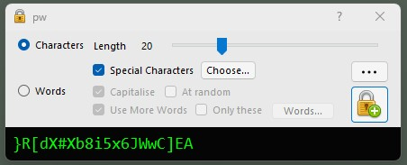
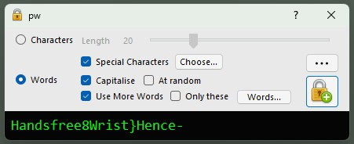
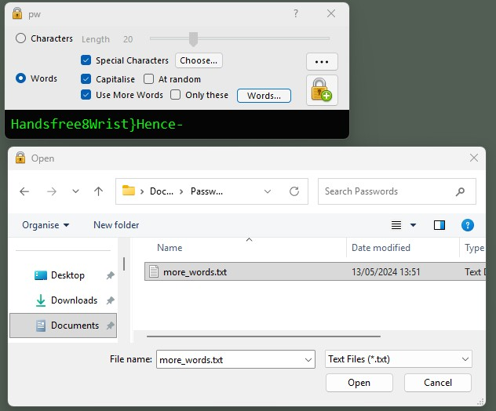
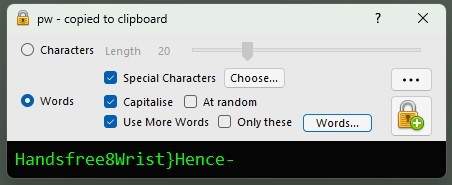
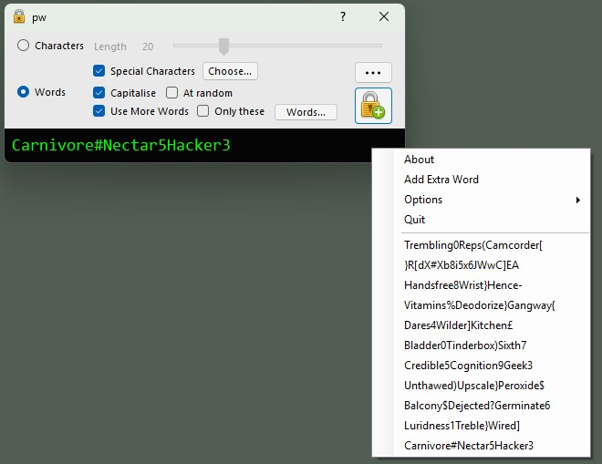
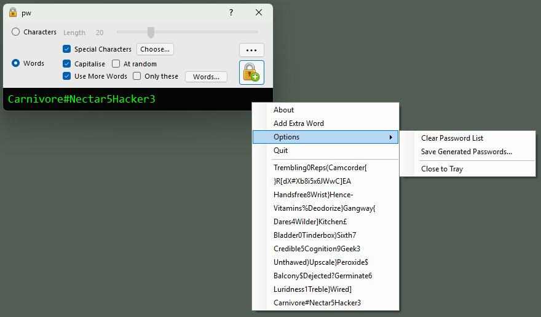
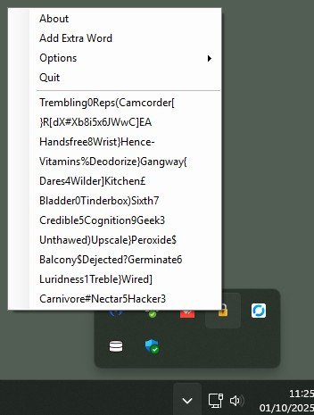

# pw

Random password generator written in C#
Uses the RandomNumberGenerator Class from System.Security.Cryptography to generate random numbers
---
Generate random character passwords with a length from 8-60

---
Generate 3 random words, capitalised and with special characters 

---
Click on the words button to use a text file of your own words. 

---
The Choose... button next to Special Characters allows you to set the special characters, or input your own selection

---
Left-click on password box to copy password to the clipboard.

---
Right-click on password box (or the 3 dots button) to bring up a menu of previously generated passwords, selecting an item will copy the password to the clipboard. Here you can also add an extra word to the generated password (either characters or words depending on which is selected).

---
The options menu allows you to clear the generated password list, save the generated password list and choose whether to close to the system tray or quit.

---
If the close to tray option is selected then closing the window with the close box now moves the application to the tray, right-clicking on the tray icon brings up the contextual menu. 
To Quit the application, select Quit from the contextual menu (or deselect the close to tray option)

