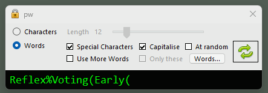

# pw
Random password generator written in C#

Uses Cryptography.RNGCryptoServiceProvider to generate random numbers

Generate random character passwords with a length from 8-40

Generate 3 random words, capitalised and with special characters 

Use a text file of your own words. 
