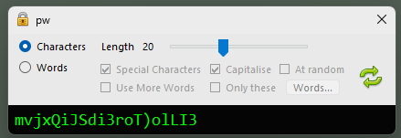

# pw
Random password generator written in C#

Uses the RandomNumberGenerator Class from System.Security.Cryptography to generate random numbers

Generate random character passwords with a length from 8-40

Generate 3 random words, capitalised and with special characters 

Use a text file of your own words. 

Left-click on password box to copy password to the clipboard.

Right-click on password box to bring up a menu of previously generated passwords, selecting an item will copy the password to the clipboard.

The options menu allows you to add a word to the current password, clear the generated password list and save the generated password list.

Closing the window with the close box now moves the application to the tray, right-clicking on the tray icon brings up the contextual menu. 
To Quit the application, select Quit from the contextual menu.
